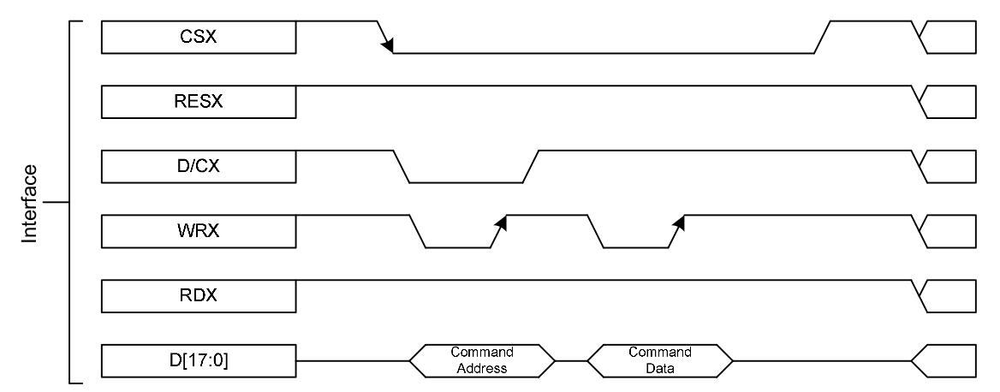

# framebuffer_driver_rpi

This is the code for the article on writing framebuffer LCD driver for Raspberry Pi (https://habr.com/ru/post/536110/). Article translation follows.

# Writing a framebuffer driver for a Raspberry Pi with LCD

After reading great series [of articles](https://habr.com/ru/post/163689/) about connecting an LCD screen to a router, I wanted to do the same. However, the diversity of the stack used (openwrt, stm32, usb), combined with the lack of complete source code made the task somewhat difficult. I decided to start small - write my own framebuffer implementation for raspberry pi and show raspberry graphical environment on LCD. 

Actually, there already exist drivers for LCD (tbtft project), but we will write our own driver to understand how everything works better.

## LCD
For this project I use LCD 320x240 with ILI9341 controller. Data is transferred via an 8-bit bus.


Writing data to the LCD is performed as follows [(p.28)](https://cdn-shop.adafruit.com/datasheets/ILI9341.pdf):


We keep 1 on RD pin and 1 on RESET pin after LCD is reset all the time. Before transferring data, we set 0 on CS pin, put 8 bits on bus pins, set 1 or 0 on RS pin (D / CX on the graph), depending on the type of transfer - data / command, reset WR to 0, then set it to 1. After data transfer is finished CS is set to 1.

```cpp
/* lcd.c */
void LCD_write(u8 VAL)
{
	LCD_CS_CLR;
	DATAOUT(VAL);
	LCD_WR_CLR;
	LCD_WR_SET;
	LCD_CS_SET;
}

/* command transfer */
void LCD_WR_REG(u8 data)
{
	LCD_RS_CLR;
	LCD_write(data);
}

/* data transfer */
void LCD_WR_DATA(u8 data)
{
	LCD_RS_SET;
	LCD_write(data);
}

/* writing data to register */
void LCD_WriteReg(u8 LCD_Reg, u8 LCD_RegValue)
{
	LCD_WR_REG(LCD_Reg);
	LCD_WR_DATA(LCD_RegValue);
}

/* transferring 16 bit of data */
void Lcd_WriteData_16Bit(u16 Data)
{
    LCD_RS_SET;
    LCD_CS_CLR;
    DATAOUT((u8)(Data>>8));
    LCD_WR_CLR;
    LCD_WR_SET;
    DATAOUT((u8)Data);
    LCD_WR_CLR;
    LCD_WR_SET;
    LCD_CS_SET;
}
```
The LCD control code is based on this [source code](http://www.lcdwiki.com/2.8inch_Arduino_Display) and adapted to raspberry pi. The color of each pixel on the LCD is specified by 16 bits in RGB565 format (5 bits for red, 6 for green, 5 for blue).

```cpp
/* lcd.h */
#define LCD_W 320
#define LCD_H 240

/* lcd.c */
/* this indicates that data for the video buffer is to be transmitted */
void LCD_WriteRAM_Prepare(void)
{
    LCD_WR_REG(0x2C);
}

/* set a rectangle on the screen that will be drawn */
void LCD_SetWindows(u16 xStart, u16 yStart,u16 xEnd,u16 yEnd)
{
    LCD_WR_REG(0x2A);
    LCD_WR_DATA(xStart>>8);
    LCD_WR_DATA(0x00FF&xStart);
    LCD_WR_DATA(xEnd>>8);
    LCD_WR_DATA(0x00FF&xEnd);

    LCD_WR_REG(0x2B);
    LCD_WR_DATA(yStart>>8);
    LCD_WR_DATA(0x00FF&yStart);
    LCD_WR_DATA(yEnd>>8);
    LCD_WR_DATA(0x00FF&yEnd);

    LCD_WriteRAM_Prepare();
}

/* display reset */
void LCD_RESET(void)
{
    LCD_RST_CLR;
    delay(100);
    LCD_RST_SET;
    delay(50);
}

/* display init */
void LCD_Init(void)
{
    LCD_RESET();
    LCD_WR_REG(0xCF);
    LCD_WR_DATA(0x00);
    LCD_WR_DATA(0xC9);
    LCD_WR_DATA(0X30);
    LCD_WR_REG(0xED);
    LCD_WR_DATA(0x64);
    LCD_WR_DATA(0x03);
    LCD_WR_DATA(0X12);
    LCD_WR_DATA(0X81);
    LCD_WR_REG(0xE8);
    LCD_WR_DATA(0x85);
    LCD_WR_DATA(0x10);
    LCD_WR_DATA(0x7A);
    LCD_WR_REG(0xCB);
    LCD_WR_DATA(0x39);
    LCD_WR_DATA(0x2C);
    LCD_WR_DATA(0x00);
    LCD_WR_DATA(0x34);
    LCD_WR_DATA(0x02);
    LCD_WR_REG(0xF7);
    LCD_WR_DATA(0x20);
    LCD_WR_REG(0xEA);
    LCD_WR_DATA(0x00);
    LCD_WR_DATA(0x00);
    LCD_WR_REG(0xC0);    
    LCD_WR_DATA(0x1B);   
    LCD_WR_REG(0xC1);    
    LCD_WR_DATA(0x00);   
    LCD_WR_REG(0xC5);    
    LCD_WR_DATA(0x30);   
    LCD_WR_DATA(0x30);   
    LCD_WR_REG(0xC7);   
    LCD_WR_DATA(0XB7);
    LCD_WR_REG(0x36);    
    LCD_WR_DATA(0x08);
    LCD_WR_REG(0x3A);
    LCD_WR_DATA(0x55);
    LCD_WR_REG(0xB1);
    LCD_WR_DATA(0x00);
    LCD_WR_DATA(0x1A);
    LCD_WR_REG(0xB6);    
    LCD_WR_DATA(0x0A);
    LCD_WR_DATA(0xA2);
    LCD_WR_REG(0xF2);    
    LCD_WR_DATA(0x00);
    LCD_WR_REG(0x26);    
    LCD_WR_DATA(0x01);
    LCD_WR_REG(0xE0);    
    LCD_WR_DATA(0x0F);
    LCD_WR_DATA(0x2A);
    LCD_WR_DATA(0x28);
    LCD_WR_DATA(0x08);
    LCD_WR_DATA(0x0E);
    LCD_WR_DATA(0x08);
    LCD_WR_DATA(0x54);
    LCD_WR_DATA(0XA9);
    LCD_WR_DATA(0x43);
    LCD_WR_DATA(0x0A);
    LCD_WR_DATA(0x0F);
    LCD_WR_DATA(0x00);
    LCD_WR_DATA(0x00);
    LCD_WR_DATA(0x00);
    LCD_WR_DATA(0x00);
    LCD_WR_REG(0XE1);    
    LCD_WR_DATA(0x00);
    LCD_WR_DATA(0x15);
    LCD_WR_DATA(0x17);
    LCD_WR_DATA(0x07);
    LCD_WR_DATA(0x11);
    LCD_WR_DATA(0x06);
    LCD_WR_DATA(0x2B);
    LCD_WR_DATA(0x56);
    LCD_WR_DATA(0x3C);
    LCD_WR_DATA(0x05);
    LCD_WR_DATA(0x10);
    LCD_WR_DATA(0x0F);
    LCD_WR_DATA(0x3F);
    LCD_WR_DATA(0x3F);
    LCD_WR_DATA(0x0F);
    LCD_WR_REG(0x2B);
    LCD_WR_DATA(0x00);
    LCD_WR_DATA(0x00);
    LCD_WR_DATA(0x01);
    LCD_WR_DATA(0x3f);
    LCD_WR_REG(0x2A);
    LCD_WR_DATA(0x00);
    LCD_WR_DATA(0x00);
    LCD_WR_DATA(0x00);
    LCD_WR_DATA(0xef);
    LCD_WR_REG(0x11); 
    delay(120);
    LCD_WR_REG(0x29); 
    LCD_WriteReg(0x36,(1<<3)|(1<<5)|(1<<6)); 
}

/* fill display with color */
void LCD_Clear(u16 Color)
{
    unsigned int i;
    LCD_SetWindows(0,0,LCD_W-1,LCD_H-1);
    for(i=0;i<LCD_H*LCD_W;i++)
    {
        Lcd_WriteData_16Bit(Color);
    }
}
/* draw a picture from a raw file (it has pixel colors in RGB565 format) */
void LCD_draw_image(char *file){
    int fd = open(file, O_RDWR);
    if(fd < 0){
        perror("Open file");
        exit(1);
    }
    u16 buffer[128];
    LCD_SetWindows(0,0,LCD_W-1,LCD_H-1);
    while(1){
        int nread = read(fd, buffer, 256);
        if(nread == 0 || nread < 0)
            break;
        /* buffer[i] - 2 bytes, so we write nread / 2 times */
        for(int i=0; i < nread/2; i++){
            Lcd_WriteData_16Bit(buffer[i]);
        }
    }
    close(fd);
}
```

## Raspberry
I am using raspberry pi 3 with raspbian lite installed (kernel version 4.14). GUI was added by installing lxde and xinit packages.

```bash
sudo apt-get install lxde xinit
```
### GPIO location

### Connecting LCD to raspberry

- LCD Data 0    -> GPIO 12
- LCD Data 1    -> GPIO 13
- ...
- LCD Data 7    -> GPIO 19
- LCD CS        -> GPIO 20
- LCD RS        -> GPIO 21
- LCD RST       -> GPIO 22
- LCD WR        -> GPIO 23
- LCD RD        -> GRPIO 24
- LCD 5V        -> 5V
- LCD GND       -> Ground

### GPIO management
The raspberry GPIO can be controlled via memory access. From the manual to [BCM 2837](https://cs140e.sergio.bz/docs/BCM2837-ARM-Peripherals.pdf) 32 bit registers GPFSEL0-5 are used to set the GPIO mode. 3 bits are allocated for each GPIO pin. Pin 0 corresponds to bits 2-0 of GPFSEL0, pin 1 of bits 5-3, etc. Each register controls 10 GPIOs. Bits 000 correspond to input mode, bits 001 to output mode. Thus the mode setting can be described as follows:

```cpp
/* rpi_gpio.h */
/* setting input mode */
#define INP_GPIO(g) *(gpio+((g)/10)) &= ~(7<<(((g)%10)*3))
/* setting output mode */
#define OUT_GPIO(g) *(gpio+((g)/10)) |=  (1<<(((g)%10)*3))
```
For pins 0 - 31 in output mode, setting 1 is done via the GPSET0 register. To set GPIO n to 1, a number with the n-th bit set to 1 must be written into the GPSET0 register. For example, to set 1 in GPIO 10 and 11, the number 0b11 << 10 must be written to the GPSET0 register.

Likewise, setting 0 is done through the GPCLR0 register.

```cpp
/* setting 1 to GPIO, e.g. 1 to GPIO 10 - GPIO_SET = 1<<10 */
#define GPIO_SET *(gpio+7)
/*  setting 0 to GPIO, e.g. 0 to GPIO 10 - GPIO_CLR = 1<<10 */
#define GPIO_CLR *(gpio+10)
```
gpio contains the virtual address of the physical address 0x3F200000 (mapped by mmap to the virtual memory of the process). \*gpio lets you refer to GPFSEL0. \*(gpio + 7) to GPSET0. \*(gpio + 10) to GPCLR0.

```cpp
/* rpi_gpio.c */
int setup_rpi_gpio()
{
    unsigned int gpio_base_addr = 0x3F200000;

   /* open /dev/mem */
   if ((mem_fd = open("/dev/mem", O_RDWR|O_SYNC) ) < 0) {
      printf("can't open /dev/mem \n");
      return -1;
   }
 
   /* mmap GPIO */
   gpio_map = mmap(
      NULL,             
      BLOCK_SIZE,       
      PROT_READ|PROT_WRITE,
      MAP_SHARED,       
      mem_fd,           
      gpio_base_addr    
   );
 
   close(mem_fd); 
 
   if (gpio_map == MAP_FAILED) {
      printf("mmap error %d\n", (int)gpio_map);
      return -1;
   }
 
   
   gpio = (volatile uint32_t *)gpio_map;
   return 0;
}
```
### LCD management

Accordingly, the LCD pins are controlled as follows:
```cpp
/* lcd.h */
#define BIT_BASE 12
#define CS   20
#define RS   21
#define RST  22
#define WR   23
#define RD   24

#define LCD_CS_SET  GPIO_SET=(1<<CS)
#define LCD_RS_SET  GPIO_SET=(1<<RS)
#define LCD_RST_SET GPIO_SET=(1<<RST)
#define LCD_WR_SET  GPIO_SET=(1<<WR)
#define LCD_RD_SET  GPIO_SET=(1<<RD)

#define LCD_CS_CLR  GPIO_CLR=(1<<CS)
#define LCD_RS_CLR  GPIO_CLR=(1<<RS)
#define LCD_RST_CLR GPIO_CLR=(1<<RST)
#define LCD_WR_CLR  GPIO_CLR=(1<<WR)
#define LCD_RD_CLR  GPIO_CLR=(1<<RD)

#define DATAOUT(x) GPIO_SET=(x<<BIT_BASE);GPIO_CLR=(x<<BIT_BASE)^(0xFF<<BIT_BASE)
```
### Testing LCD in user space

Before diving into the kernel, let's check the LCD in user space.

Let's prepare a picture "image.jpg" in raw 320x240 format. "output.raw" contains contiguous 16-bit color values ​​for each pixel (RGB565):

```bash
mogrify -format bmp -resize 320 -crop 320x240 image.jpg
ffmpeg -vcodec bmp -i image.bmp -vcodec rawvideo -f rawvideo -pix_fmt rgb565 output.raw
```
Let's put output.raw to LCD:
```cpp
/*  main.c */
int main(int argc , char *argv[]){
    if( setup_rpi_gpio() ) {
        printf("Cannot map GPIO memory, probably use <sudo>\n");
        return -1;
    }
    for(int i = BIT_BASE; i <= RD; i++){
        INP_GPIO(i);
        OUT_GPIO(i);
    }
    //set BITS_BASE - RD to 1
    GPIO_SET = 0xFFF<<12;
    GPIO_SET = 1 << RD;
    LCD_Init();

    if(argc >= 2){
        LCD_draw_image(argv[1]);
    }
}
```

```bash
gcc main.c rpi_gpio.c lcd.c -o main
sudo ./main output.raw
```


### Preparing the environment
If everything works, it's time to start preparing the environment for compiling and running the driver.

Kernel headers for the current kernel version in raspbian could not be installed, so let's download the linux kernel source code, compile and install the kernel, and use kernel headers and build scripts to compile the driver. The main reference on this process is [here](https://www.raspberrypi.org/documentation/linux/kernel/building.md). I used the same kernel as in my raspbian version.

```bash
git clone --depth=1 -b rpi-4.14.y https://github.com/raspberrypi/linux.git
cd linux
KERNEL=kernel7
make bcm2709_defconfig
make -j4 zImage modules dtbs
sudo make modules_install
sudo cp arch/arm/boot/dts/*.dtb /boot/
sudo cp arch/arm/boot/dts/overlays/*.dtb* /boot/overlays/
sudo cp arch/arm/boot/dts/overlays/README /boot/overlays/
sudo cp arch/arm/boot/zImage /boot/$KERNEL.img

```
Compile the driver with the "make" command, placing the following Makefile in the folder with the driver source code:
```bash
ifeq ($(KERNELRELEASE),)

    KERNELDIR ?= /lib/modules/$(shell uname -r)/build    
    PWD := $(shell pwd)

modules:
    $(MAKE) -C $(KERNELDIR) M=$(PWD) modules

modules_install:
    $(MAKE) -C $(KERNELDIR) M=$(PWD) modules_install

clean:
    rm -rf *.o *~ core .depend .*.cmd *.ko *.mod.c .tmp_versions

.PHONY: modules modules_install clean

else
    # driver name, if compile vfb.c, replace with vfb.o    
    obj-m := lcd_drv_simple.o
endif
```
### Framebuffer driver
The framebuffer theory is well described [here](https://habr.com/ru/post/163689/) and [here](https://habr.com/ru/post/213775/), so I won't repeat it.

Let's start with a virtual framebuffer (vfb.c). It allocates an area of ​​memory that user app writes to when working with /dev/fbX device (X is the device number). The written image can then be easily read through cat /dev/fbX. This driver is convenient for testing (in our case, that the compilation and installation of the driver is successful).

We take the code from [here](https://elixir.bootlin.com/linux/v3.12.43/source/drivers/video/vfb.c). Then

```bash
make
sudo cp vfb.ko /lib/modules/$(uname -r)/extra/
# updating dependencies
sudo depmod
# loading driver
sudo modprobe vfb_enable=1
# setting the screen size and color depth (16 bit, RGB565 mode)
fbset -fb /dev/fb1 -g 320 240 320 240 16
```
A new framebuffer device (/dev/fb1) should appear. Let's write some image into it,
```bash
sudo apt-get install fbi
# fbi requires starting from a full-fledged console, if running under ssh use sudo and -T 1 to specify the first console
sudo fbi -a -d /dev/fb1 -T 1 image.jpg
```
read it back
```bash
cat /dev/fb1 > scrn.raw
```
and open it in gimp as raw rgb565. Make sure the image does exist.

### Simple driver

We take the driver code from the [article](https://habr.com/ru/post/163689/) as a basis. To begin with, let's make our life easier by writing the entire video buffer to the LCD, not just the changed parts of the image, when updating the screen in the LCD.

We modify the setting of the mode and level (1/0) of pins as follows (just direct access to I / O memory in the kernel does not work):


```cpp
/* lcd_drv_simple.c */
static void inp_gpio(u32 g){
    u32 *addr = gpio+g/10;
    u32 val = readl(addr);
    u32 tmp =  ~(7<<((g%10)*3));
    val &= tmp;
    writel(val,addr);
}
static void out_gpio(u32 g){
    u32 *addr = gpio+g/10;
    u32 val = readl(addr);
    u32 tmp =  (1<<(((g)%10)*3));
    val |= tmp;
    writel(val,addr);
}
static void GPIO_SET(u32 val){
    writel(val,gpio+7);
}
static void GPIO_CLR(u32 val){
    writel(val,gpio+10);
}
```
The gpio address is obtained by calling ioremap:
```cpp 
gpio = ioremap(PORT, RANGE);
```
Driver parameters are described in the following structures:
```cpp
u32 *gpio;
static unsigned PORT = 0x3F200000;
static unsigned RANGE =  0x40;

#define W 320
#define H 240

static struct fb_fix_screeninfo ili9341_fix  = {
        .type        = FB_TYPE_PACKED_PIXELS,
        .visual      = FB_VISUAL_TRUECOLOR,
        .accel       = FB_ACCEL_NONE,
        .line_length = W * 2,
};

static struct fb_var_screeninfo ili9341_var  = {
        .xres        = W,
        .yres        = H,
        .xres_virtual    = W,
        .yres_virtual    = H,
        .width        = W,
        .height        = H,
        .bits_per_pixel = 16,
        .red         = {11, 5, 0}, /* 11 bit offset, 5 bits per red */
        .green         = {5, 6, 0}, /* 5 bit offset, 6 bits per green */
        .blue         = {0, 5, 0}, /* 0 bit offset, 5 bits per blue */
        .activate     = FB_ACTIVATE_NOW,
        .vmode     = FB_VMODE_NONINTERLACED,
};

/* we use a kernel-provided implementation of operations with framebuffer */
static struct fb_ops ili9341_fbops = {
        .owner        = THIS_MODULE,
        .fb_write     = fb_sys_write,
        .fb_fillrect  = sys_fillrect,
        .fb_copyarea  = sys_copyarea,
        .fb_imageblit = sys_imageblit,
        .fb_setcolreg   = ili9341_setcolreg,
};

/* references to probe and remove functions */
struct platform_driver ili9341_driver = {
        .probe = ili9341_probe,
        .remove = ili9341_remove,
        .driver = { .name = "my_fb_driver" }
};

/* set the function ili9341_update, which updates the screen (the refresh rate is set in the delay parameter) */
static struct fb_deferred_io ili9341_defio = {
        .delay          = HZ / 5,
        .deferred_io    = &ili9341_update,
};
```
Main fuctions:
```cpp
static int  ili9341_probe(struct platform_device *dev)
{
    int ret = 0;
    struct ili9341 *item;
    struct fb_info *info;
    unsigned char  *videomemory;
    printk("ili9341_probe\n");

    /* allocate memory for an auxiliary structure for pointer storage */    
    item = kzalloc(sizeof(struct ili9341), GFP_KERNEL);
    if (!item) {
        printk(KERN_ALERT "unable to kzalloc for ili9341\n");
        ret = -ENOMEM;
        goto out;
    }

    /* fill it */
    item->dev = &dev->dev;
    dev_set_drvdata(&dev->dev, item);
    
    /* get a reference to minimally initialized fb_info */
    info = framebuffer_alloc(0, &dev->dev);
    if (!info) {
        ret = -ENOMEM;
        printk(KERN_ALERT "unable to framebuffer_alloc\n");
        goto out_item;
    }
    item->info = info;

    /* fill fb_info structure with our data */
    info->par = item;
    info->dev = &dev->dev;
    info->fbops = &ili9341_fbops;
    info->flags = FBINFO_FLAG_DEFAULT;
    info->fix = ili9341_fix;
    info->var = ili9341_var;
    info->fix.smem_len = VIDEOMEM_SIZE; // video memory buffer size
    info->pseudo_palette = &pseudo_palette;
    
    /* allocate memory for the video buffer which is written into by applications using /dev/fbX */    
    videomemory=vmalloc(info->fix.smem_len);
    if (!videomemory)
    {
        printk(KERN_ALERT "Can not allocate memory for framebuffer\n");
        ret = -ENOMEM;
        goto out_info;
    }
    
    /* we set it in the fb_info structure and keep it in our ili9341 structure for further use */    
    info->fix.smem_start =(unsigned long)(videomemory);
    info->screen_base = (char __iomem *)info->fix.smem_start;
    item->videomem = videomemory;

    /* fill in the information about the deferred screen update */
    info->fbdefio = &ili9341_defio;
    fb_deferred_io_init(info);
    
    /* pass the filled fb_info structure to the kernel */
    ret = register_framebuffer(info);
    if (ret < 0) {
        printk(KERN_ALERT "unable to register_frambuffer\n");
        goto out_pages;
    }

    if (ili9341_setup(item)) goto out_pages;
    return ret;

    out_pages:
    kfree(videomemory);
    out_info:
    framebuffer_release(info);
    out_item:
    kfree(item);
    out:
    return ret;
}

int ili9341_setup(struct ili9341 *item)
{
    int i;
    
    /* map the address for working with GPIO ports on gpio */
    gpio = ioremap(PORT, RANGE);
    if(gpio == NULL){
        printk(KERN_ALERT "ioremap error\n");
        return 1;
    }

    /* inilitalize LCD */
    for(i = BIT_BASE; i <= RD; i++){
        inp_gpio(i);
        out_gpio(i);
    }
    GPIO_SET(0xFFF<<12);
    GPIO_SET(1 << RD);
    LCD_Init();
    printk("ili9341_setup\n");
    return 0;
}
static void ili9341_update(struct fb_info *info, struct list_head *pagelist)
{
    /* get a reference to our pointers structure */
    struct ili9341 *item = (struct ili9341 *)info->par;
    /* video memory address */
    u16 *videomemory = (u16 *)item->videomem;
    int i, j, k;

    /* fill the entire screen */
    LCD_SetWindows(0,0,LCD_W-1,LCD_H-1);    
    for(i = 0; i < LCD_W * LCD_H; i++){        
        /* read data from video memory pixel by pixel and write it to LCD */
        Lcd_WriteData_16Bit(readw(videomemory));
        videomemory++;
    }
}
```
### Launching the desktop environment on LCD
Check the driver operation. Compile and install it to the kernel
```bash
make
sudo cp lcd_drv_simple.ko /lib/modules/$(uname -r)/extra/
sudo depmod
sudo modprobe lcd_drv_simple
```
Display a random image:
```bash
cat /dev/urandom > /dev/fb1
```

Display a picture or video on the corresponding /dev/fbX:
```bash
sudo fbi -a -d /dev/fb1 -T 1 image.jpg
mplayer -vo fbdev:/dev/fb1 video.mp4
```
Let's launch the desktop environment on LCD. If it is not already installed (for example, the server variant of raspbian), you can install it:
```bash
sudo apt-get install lxde
```

Create file /etc/X11/xorg.conf:
```bash
Section "Device"
    Identifier "FBDEV"
    Driver "fbdev"
    Option "fbdev" "/dev/fb1"
EndSection

```

and add the following line to /etc/rc.local:
```bash
/sbin/modprobe lcd_drv_simple
```
After reboot, a desktop environment should appear on LCD.


### Speed up the driver
The previous driver version is simple, but not very fast. Complete screen redrawing is noticeable. The good thing about Deferred_io is that the kernel passes the list of updated video memory pages (that are needed to be redrawn on screen) to ili9341_update function. That is it is necessary to understand which area of the screen corresponds to the given 4096 bytes (memory page size).
- The first 4096 bytes correspond to the full 6 lines and 128 pixels of the 7th line, because 4096 = 320\*2\*6 + 128\*2 (2 bytes for each pixel)
- The second 4096 bytes start at 129th pixel of 7th line, require 384 bytes to complete the line (128\*2 + 384 = 640), then there are 5 full lines and 256 pixels in 6 lines (4096 = 384 + 640\*5 + 512).

By continuing the reasoning further, it turns out that every 5 pages the situation is repeated. Therefore, it is enough to take into account 5 variants for drawing memory page on the screen. Besides, we need to account for the last page number 37, because it takes 2048 bytes:

```cpp
/* lcd_drv_fast.c */

/* further we use atomic operations, which in fact are not needed, since the ili9341_touch method on raspberry has never been called (i.e. there is no situation of multiple threads of execution changing toUpdate at the same time */
static void ili9341_update(struct fb_info *info, struct list_head *pagelist)
{
    struct ili9341 *item = (struct ili9341 *)info->par;
    struct page *page;
    int i;    
    /* for updated pages, subtract 1 from toUpdate atomically, toUpdate for these pages takes on the value -2 */
    list_for_each_entry(page, pagelist, lru)
    {
        atomic_dec(&item->videopages[page->index].toUpdate);
    }
    for (i=0; i<FP_PAGE_COUNT; i++)
    {
        /* for all pages, increase toUpdate by 1. If the page is not updated, then subtract 1 back and get -1. If the page is updated, we will also get -1 after the increment, but in this case we will also render the changed page */
        if(atomic_inc_and_test(&item->videopages[i].toUpdate)){
            atomic_dec(&item->videopages[i].toUpdate);
        }
        else
        {
            draw(item, i);          
        }
    }

}
static void draw(struct ili9341 *item, int page){
    int xs,ys,i;
    /* calculate the page address in video memory */
    u16 *videomemory = (u16*)(item->videomem + PAGE_SIZE*page);

    /* the LCD line that the page starts with */
    ys = (((unsigned long)(PAGE_SIZE*page)>>1)/W);
    
    /* short memory page, process separately */
    if (page == 37){
        // write PAGE_SIZE / 2;
        //write 128 bytes
        LCD_SetWindows(256, ys, LCD_W-1, ys);
        for(i = 0; i < 128 / 2; i++){
            Lcd_WriteData_16Bit(readw(videomemory));
            videomemory++;
        }
        //write 3 lines
        LCD_SetWindows(0, ys+1, LCD_W-1, ys+6);
        for(i = 0; i < 640 * 3 / 2; i++){
            Lcd_WriteData_16Bit(readw(videomemory));
            videomemory++;
        }

    }
    else{
        switch (page % 5){
        //xs = 0. write full six lines and 256 bytes
        //640 * 6 + 256
        case 0:
            //write 6 lines
            LCD_SetWindows(0,ys,LCD_W-1,ys + 5);
            for(i = 0; i < 640 * 6 / 2; i++){
                Lcd_WriteData_16Bit(readw(videomemory));
                videomemory++;
            }
            //write 256 bytes
            LCD_SetWindows(0, ys+6, 256/2-1, ys + 6); //7th line from x = 0 to x = 256/2
            for(i = 0; i < 256 / 2; i++){
                Lcd_WriteData_16Bit(readw(videomemory));
                videomemory++;
            }
            break;
        //xs = 128 (256 bytes). write 384 bytes, 5 full lines and 512 bytes
        //384 + 640 * 5 + 512
        case 1:
            //write 384 bytes
            LCD_SetWindows(256/2, ys, LCD_W-1, ys);
            for(i = 0; i < 384 / 2; i++){
                Lcd_WriteData_16Bit(readw(videomemory));
                videomemory++;
            }
            //write 5 lines
            LCD_SetWindows(0, ys+1, LCD_W-1, ys+5);
            for(i = 0; i < 640 * 5 / 2; i++){
                Lcd_WriteData_16Bit(readw(videomemory));
                videomemory++;
            }
            //write 512 bytes
            LCD_SetWindows(0, ys+6, 512/2-1, ys+6);
            for(i = 0; i < 512 / 2; i++){
                Lcd_WriteData_16Bit(readw(videomemory));
                videomemory++;
            }
            break;
        //xs = 256 (512 bytes). write 128 bytes, then 6 full lines and 128 bytes
        //128 + 640*6 + 128
        case 2:
            //write 128 bytes
            LCD_SetWindows(256, ys, LCD_W-1, ys);
            for(i = 0; i < 128 / 2; i++){
                Lcd_WriteData_16Bit(readw(videomemory));
                videomemory++;
            }
            //write 6 lines
            LCD_SetWindows(0, ys+1, LCD_W-1, ys+6);
            for(i = 0; i < 640 * 6 / 2; i++){
                Lcd_WriteData_16Bit(readw(videomemory));
                videomemory++;
            }
            //write 128 bytes
            LCD_SetWindows(0, ys+7, 128/2-1, ys+7);
            for(i = 0; i < 128 / 2; i++){
                Lcd_WriteData_16Bit(readw(videomemory));
                videomemory++;
            }
            break;
        //xs = 64 (128 /2). write 512 bytes, then 5 lines and 384 bytes
        //512 + 640*5 + 384
        case 3:
            //write 512 bytes
            LCD_SetWindows(64, ys, LCD_W-1, ys);
            for(i = 0; i < 512 / 2; i++){
                Lcd_WriteData_16Bit(readw(videomemory));
                videomemory++;
            }
            //write 5 lines
            LCD_SetWindows(0, ys+1, LCD_W-1, ys+5);
            for(i = 0; i < 640 * 5 / 2; i++){
                Lcd_WriteData_16Bit(readw(videomemory));
                videomemory++;
            }
            //write 384 bytes
            LCD_SetWindows(0, ys+6, 384/2-1, ys+6);
            for(i = 0; i < 384 / 2; i++){
                Lcd_WriteData_16Bit(readw(videomemory));
                videomemory++;
            }
            break;
        //xs = 384/2. write 256 bytes, then 6 full lines
        //256 + 640*6
        case 4:
            //write 256 bytes
            LCD_SetWindows(384/2, ys, LCD_W-1, ys);
            for(i = 0; i < 256 / 2; i++){
                Lcd_WriteData_16Bit(readw(videomemory));
                videomemory++;
            }
            LCD_SetWindows(0, ys+1, LCD_W-1, ys+6);
            for(i = 0; i < 640 * 6 / 2; i++){
                Lcd_WriteData_16Bit(readw(videomemory));
                videomemory++;
            }
            break;
        default: break;

        }
    }
}

```
Also small changes in the ili9341 structure and ili9341_probe function:
```cpp
struct videopage
{
    atomic_t toUpdate;
};
struct ili9341 {
    struct device *dev;
    struct fb_info *info;
    unsigned char *videomem;    
    /* here we mark the changes in the memory pages */
    struct videopage videopages[FP_PAGE_COUNT];
};
static int  ili9341_probe(struct platform_device *dev){
    ...    
    /* initialize an array to track changes in memory pages */
    for(i=0;i<FP_PAGE_COUNT;i++)
    {
        atomic_set(&item->videopages[i].toUpdate, -1);      
    }
}

```
In the ili9341_fbops structure, we use our own functions, which work as a wrapper over the standard ones, while marking the changed pages using the ili9341_touch function. The thing is that if the kernel uses the drawing functions specified by the ili9341_fbops structure, the updated memory pages are not passed into ili9341_update and should be marked separately. In fact, the raspbian graphics subsystem does not use these functions.

```cpp
static struct fb_ops ili9341_fbops = {
        .owner        = THIS_MODULE,
        .fb_write     = ili9341_write,
        .fb_fillrect  = ili9341_fillrect,
        .fb_copyarea  = ili9341_copyarea,
        .fb_imageblit = ili9341_imageblit,
        .fb_setcolreg   = ili9341_setcolreg,
};

static ssize_t ili9341_write(struct fb_info *p, const char __user *buf, size_t count, loff_t *ppos){
    ssize_t retval;
    printk("ili9341_write\n");
    retval=fb_sys_write(p, buf, count, ppos);
    ili9341_touch(p, 0, 0, p->var.xres, p->var.yres);
    return retval;
}
static void ili9341_fillrect(struct fb_info *p, const struct fb_fillrect *rect)
{
    printk("ili9341_fillrect\n");
    sys_fillrect(p, rect);
    ili9341_touch(p, rect->dx, rect->dy, rect->width, rect->height);
}
static void ili9341_imageblit(struct fb_info *p, const struct fb_image *image)
{
    printk("ili9341_imageblit\n");
    sys_imageblit(p, image);
    ili9341_touch(p, image->dx, image->dy, image->width, image->height);
}

static void ili9341_copyarea(struct fb_info *p, const struct fb_copyarea *area)
{
    printk("ili9341_copyarea\n");
    sys_copyarea(p, area);
    ili9341_touch(p, area->dx, area->dy, area->width, area->height);
}
static void ili9341_touch(struct fb_info *info, int x, int y, int w, int h)
{

    struct ili9341 *item = (struct ili9341 *)info->par;
    int firstPage;
    int lastPage;
    int i;
    printk("touch x %d, y %d, w %d, h %d",x,y,w,h);
    firstPage=((y*W)+x)*BYTE_DEPTH/PAGE_SIZE-1;
    lastPage=(((y+h)*W)+x+w)*BYTE_DEPTH/PAGE_SIZE+1;

    if(firstPage<0)
        firstPage=0;
    if(lastPage>FP_PAGE_COUNT)
        lastPage=FP_PAGE_COUNT;

    for(i=firstPage;i<lastPage;i++)
        atomic_dec(&item->videopages[i].toUpdate);

    schedule_delayed_work(&info->deferred_work, info->fbdefio->delay);
}
```

### Dual screen system

Let's experiment a little and connect two screens to the raspberry. As the main screen, we use a screen / TV connected to HDMI. LCD is used as the second screen.

To make dragging and dropping windows between screens better visible, I "increase" the size of LCD screen that linux sees to 640x480. In the kernel I register a 640x480 screen, however only every second pixel in a line is written to the LCD and every second line is skipped. Modified ili9341_update code:

```cpp
/* lcd_drv_simple_640_480.c */

#define W 320*2
#define H 240*2

/* changes in ili9341_update using a simple driver as an example */
for(j = 0; j < H; j++){
    if (j % 2 == 1){ //skip
        videomemory += W;
    }
    else{
        for(i = 0; i < W; i += 2){
            Lcd_WriteData_16Bit(readw(videomemory));
            videomemory += 2;               
        }
    }
}
```

To work with two screens, their color depth should be the same. So the following is added to /boot/config.txt:

```bash
[all]
framebuffer_depth=16
```
Install xinerama to drag and drop windows between screens:
```bash
sudo apt-get install libxinerama-dev
```

Change /etc/X11/xorg.conf
```bash
Section "Device"
        Identifier      "LCD"
        Driver          "fbdev"
        Option          "fbdev" "/dev/fb1"
        Option          "ShadowFB" "off"
        Option          "SwapbuffersWait" "true"
EndSection

Section "Device"
        Identifier      "HDMI"
        Driver          "fbdev"
        Option          "fbdev" "/dev/fb0"
        Option          "ShadowFB" "off"
        Option          "SwapbuffersWait" "true"
EndSection

Section "Monitor"
        Identifier      "LCD-monitor"
        Option          "RightOf" "HDMI-monitor"
EndSection

Section "Monitor"
        Identifier      "HDMI-monitor"
        Option          "Primary" "true"        
EndSection

Section "Screen"
        Identifier      "screen0"
        Device          "LCD"
        Monitor         "LCD-monitor"
EndSection

Section "Screen"
        Identifier      "screen1"
        Device          "HDMI" 
        Monitor         "HDMI-monitor"
EndSection

Section "ServerLayout"
        Identifier      "default"
        Option          "Xinerama" "on"
        Option          "Clone" "off"
        Screen 0        "screen0" RightOf "screen1"
        Screen 1        "screen1" 
EndSection
```
Result:


## Conclusion

Hope the above is interesting. Code is [here](https://github.com/dsoastro/framebuffer_driver_rpi).
